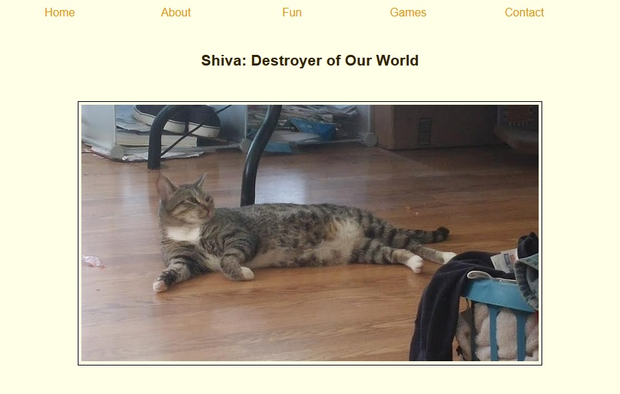

# :cat: [Shiva, Destroyer of Worlds](https://karenfreemansmith.github.io/EpicIntroWk1-PetWebsite) :earth_africa:
Version 0.0.1: August 2, 2016
by [Karen Freeman-Smith](https://karenfreemansmith.github.io)

## Description
A pet website. Written for Epicodus Intro to Programming (Week 1) to learn basic page layout and css techniques.

## Technologies Used
HTML, CSS

## Setup/Installation
* [View on Github Pages](https://karenfreemansmith.github.io/EpicIntroWk1-PetWebsite)
* _OR_
* Clone diectory 
* Open index.html in your favorite browser

## Support & Contact
For questions, concerns, or suggestions please email karenfreemansmith@gmail.com

## Known Issues
* None

## Legal
*Licensed under the GNU General Public License v3.0*

Copyright (c) 2016 Copyright _[Karen Freeman-Smith](https://karenfreemansmith.github.io)_ All Rights Reserved.
