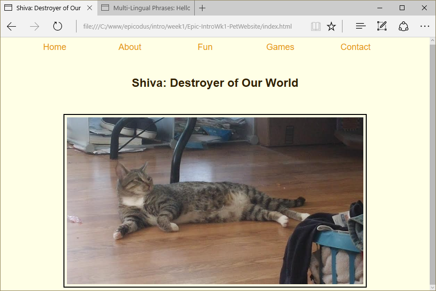

# Pet Website (Shiva, Destroyer of Worlds)
Version 0.0.1: August 2, 2016
by [Karen Freeman-Smith](https://karenfreemansmith.github.io) and [Amber Farrington](https://github.com/NWShadowDev)

### Technologies Used
HTML, CSS, Git, Github

## Description
*Epicodus Intro to Programming Week 1 Pair Project with Amber Farrington: Build a pet website to learn fundamentals of HTML and CSS.*

## Setup/Installation
* [View on Github Pages](https://karenfreemansmith.github.io/Epic-IntroWk1-PetWebsite)

 __OR__
* Clone project to your computer
* Open index.html in your favorite browser

## Support & Contact
For questions, concerns, or suggestions please email karenfreemansmith@gmail.com

## Known Issues
* None

## Legal
* Licensed under the GNU General Public License v3.0

Copyright (c) 2016 Copyright _[Karen Freeman-Smith](https://karenfreemansmith.github.io) & [Amber Farrington](https://github.com/NWShadowDev)_ All Rights Reserved.
